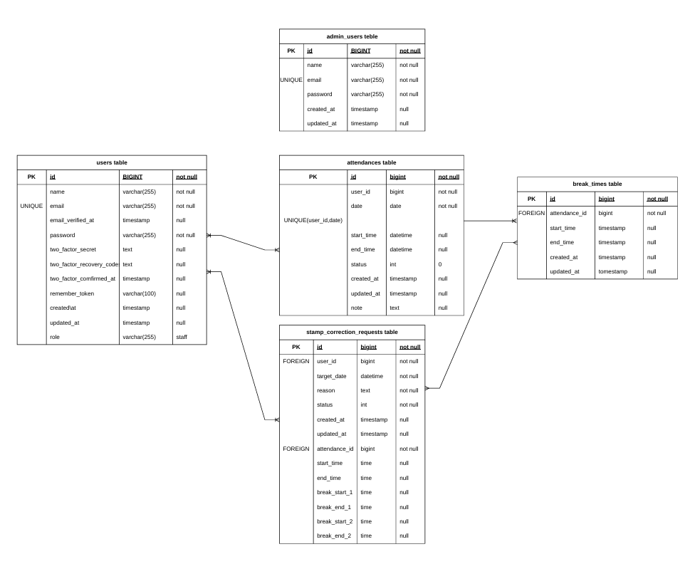

# coachtech 勤怠管理アプリ

## ■ プロジェクト概要

本アプリは、ある企業が開発した独自の勤怠管理システムです。  
ユーザーの勤怠打刻および管理を目的としたWebアプリケーションです。  

## ■ サービス概要

* サービス名：coachtech 勤怠管理アプリ  
* 概要：ユーザーの勤怠情報を記録・管理するシステム  

## ■ 制作背景・目的

既存の勤怠管理システムは機能や画面が複雑で使いづらいという課題があり、  
シンプルで直感的に使える勤怠管理アプリの開発を目的としました。  

## ■ 制作目標

* 初年度ユーザー数：1000人達成

## ■ 作業範囲

* 設計
* コーディング
* テスト

## ■ 開発環境

* 言語：PHP
* フレームワーク：Laravel
* データベース：MySQL
* バージョン管理：GitHub
* 開発環境：Docker

## ■ ターゲットユーザー

* 社会人全般

## ■ 対応ブラウザ

* Chrome（最新版）
* Firefox（最新版）
* Safari（最新版）

---

## ■ 主な機能

### ▼ 認証機能

* 会員登録（メール認証あり）
* ログイン / ログアウト
* 管理者ログイン

### ▼ 勤怠管理機能

* 出勤 / 退勤
* 休憩（複数回対応）
* ステータス管理（勤務外 / 出勤中 / 休憩中 / 退勤済）

### ▼ 勤怠確認機能

* 勤怠一覧（月別表示）
* 勤怠詳細確認

### ▼ 修正申請機能

* 勤怠修正申請
* 承認待ち / 承認済みの管理

### ▼ 管理者機能

* 全ユーザーの勤怠一覧確認
* 勤怠詳細の修正
* 修正申請の承認
* スタッフ一覧表示
* CSV出力機能

---

## ■ メール認証機能

* 会員登録時に認証メール送信
* 未認証時は認証誘導画面へ遷移
* 認証メール再送機能あり

---

## ■ 非機能要件

* 運用・保守：クライアントが実施
* リリース予定：開発開始から4ヶ月後
* セキュリティ：アプリケーション内で考慮
* SEO：対象外
* コード品質：コーディング規約に準拠

---

## ■ インフラ

* 本番環境：未使用
* 開発環境：ローカル環境
* サーバー：未使用
* ドメイン：未取得
* SSL：未対応

---

## ■ データベース設計

ER図に基づき以下のテーブルで構成されています。  

* users
* admin_users
* attendances
* break_times
* stamp_correction_requests

  

---

## ■ URL

* アプリ：http://127.0.0.1:8080

## ■ テスト

* 単体テスト・機能テストを実施
* メール認証機能のテストを含む

---

## ■ 開発体制

* 個人開発

---

## ■ 環境構築手順

### 1. リポジトリをクローン
 
git clone https://github.com/kay4300/kintai.git
cd kintai  

---

### 2. Dockerコンテナを起動

```bash  
docker-compose up -d
```

---

### 3. PHPコンテナに入る

```bash  
docker-compose exec php bash
```

---

### 4. Laravelの初期設定

```bash  
composer install  
cp .env.example .env  
php artisan key:generate  
```

---

### 5. データベース設定

.env に以下を設定してください：  

```env  
DB_CONNECTION=mysql  
DB_HOST=mysql  
DB_PORT=3306  
DB_DATABASE=laravel_db  
DB_USERNAME=laravel_user  
DB_PASSWORD=laravel_pass  
```  
※ .env は環境に応じて適宜変更してください  

---

### 6. マイグレーション実行

```bash  
php artisan migrate  
php artisan db:seed  
```  

---

### 7. アプリケーションにアクセス

* アプリ：http://127.0.0.1:8080
* phpMyAdmin：http://localhost:8081
* MailHog：http://localhost:8025

---

## ■ 使用技術

* Nginx：1.21.1
* PHP：Dockerビルド（./docker/php）
* MySQL：8.0.36
* phpMyAdmin
* MailHog

---

## ■ メール確認方法

MailHogを使用しています。  
以下URLから送信されたメールを確認できます。  

* http://localhost:8025

---

## ■　テスト

```bash  
php artisan test  
```  

## ■ バージョン

* Laravel：10.50.2
* PHP：8.2.30

---

## ■ 補足

* ソースコードは `src` ディレクトリ配下に配置されています
* DBデータはDockerボリュームで管理されています

  